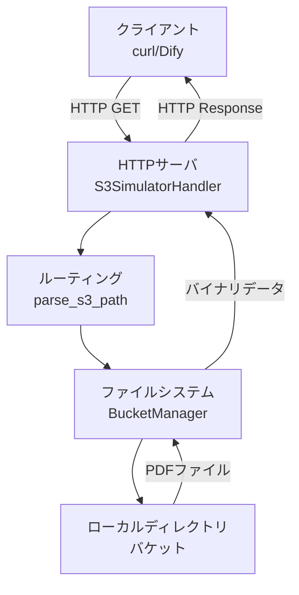
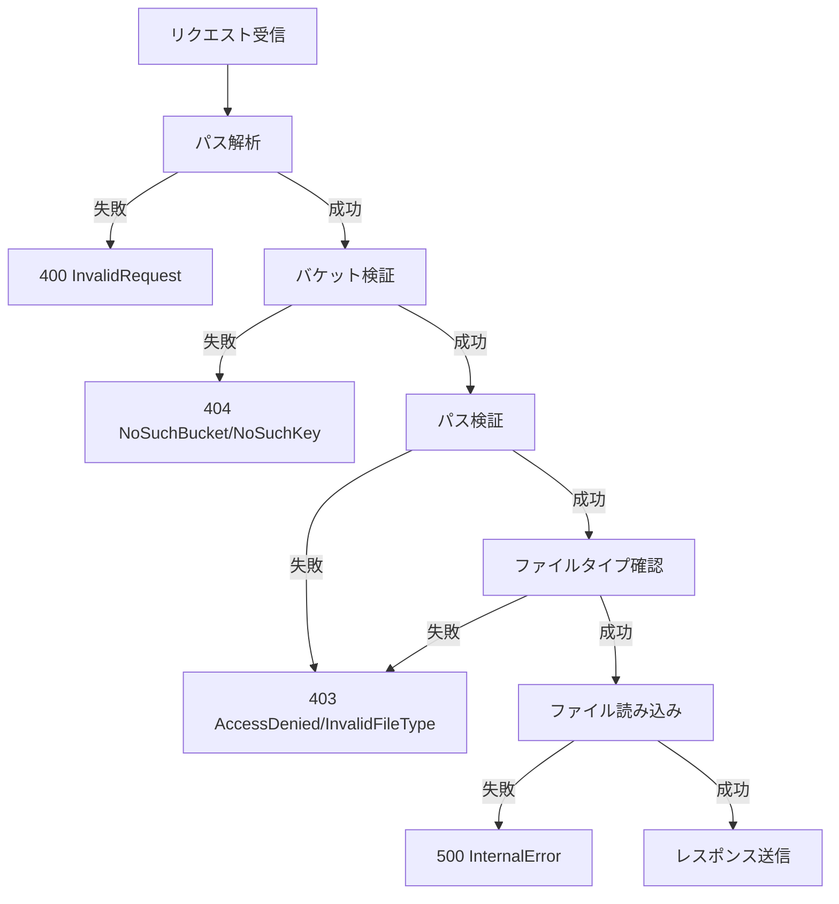

# 設計書

## 概要

本システムは、Pythonの標準ライブラリのみを使用したS3 API互換の簡易シミュレーターです。`http.server`モジュールを使用してHTTPサーバを構築し、ローカルファイルシステム上のディレクトリをS3バケットとして扱い、PDFファイルのダウンロード機能を提供します。

### 主要な設計決定

1. **HTTPサーバ**: `http.server.HTTPServer`と`http.server.BaseHTTPRequestHandler`を使用
2. **パス処理**: `pathlib.Path`を使用してクロスプラットフォーム対応
3. **URL処理**: `urllib.parse`を使用してURLデコード
4. **設定管理**: コマンドライン引数（`argparse`）または環境変数で設定
5. **ログ出力**: 標準出力に全リクエストをログ出力

## アーキテクチャ



### レイヤー構造

1. **HTTPレイヤー**: リクエスト受信、レスポンス送信、エラーハンドリング
2. **ルーティングレイヤー**: S3 APIパス解析、バリデーション
3. **ストレージレイヤー**: ファイルシステムアクセス、セキュリティチェック

## コンポーネントとインターフェース

### 1. メインモジュール (`s3_simulator.py`)

プログラムのエントリーポイントとサーバ起動を担当します。

```python
def main():
    """
    サーバを起動するメイン関数
    - コマンドライン引数を解析
    - BucketManagerを初期化
    - HTTPサーバを起動
    """
    pass
```

### 2. BucketManager クラス

バケット（ローカルディレクトリ）の管理とファイルアクセスを担当します。

```python
class BucketManager:
    """
    バケットとファイルシステムの管理
    
    属性:
        buckets: dict[str, Path] - バケット名とディレクトリパスのマッピング
    """
    
    def __init__(self, bucket_configs: dict[str, str]):
        """
        バケット設定を初期化
        
        引数:
            bucket_configs: {bucket_name: directory_path}
        """
        pass
    
    def get_file(self, bucket: str, key: str) -> bytes:
        """
        指定されたバケットとキーからファイルを取得
        
        引数:
            bucket: バケット名
            key: オブジェクトキー（ファイルパス）
        
        戻り値:
            ファイルのバイナリデータ
        
        例外:
            BucketNotFoundError: バケットが存在しない
            ObjectNotFoundError: ファイルが存在しない
            SecurityError: バケット外のファイルアクセス試行
            FileTypeError: PDFファイル以外へのアクセス
        """
        pass
    
    def validate_bucket(self, bucket: str) -> bool:
        """バケットの存在確認"""
        pass
    
    def _is_safe_path(self, base_path: Path, target_path: Path) -> bool:
        """パストラバーサル攻撃を防ぐ"""
        pass
```

### 3. S3SimulatorHandler クラス

HTTPリクエストを処理し、S3 APIエンドポイントをシミュレートします。

```python
class S3SimulatorHandler(BaseHTTPRequestHandler):
    """
    S3 API互換のHTTPリクエストハンドラ
    
    クラス変数:
        bucket_manager: BucketManager - 共有バケットマネージャー
    """
    
    def do_GET(self):
        """
        GETリクエストを処理
        - パスを解析（/{bucket}/{key}）
        - ファイルを取得
        - レスポンスを返す
        """
        pass
    
    def _parse_s3_path(self, path: str) -> tuple[str, str]:
        """
        S3パスを解析
        
        引数:
            path: リクエストパス（例: /mybucket/docs/file.pdf）
        
        戻り値:
            (bucket_name, object_key)
        
        例外:
            ValueError: パス形式が不正
        """
        pass
    
    def _send_file_response(self, file_data: bytes):
        """PDFファイルレスポンスを送信"""
        pass
    
    def _send_error_response(self, status_code: int, error_code: str, message: str):
        """JSONエラーレスポンスを送信"""
        pass
    
    def log_message(self, format: str, *args):
        """リクエストログを標準出力に出力"""
        pass
```

### 4. カスタム例外クラス

```python
class S3SimulatorError(Exception):
    """基底例外クラス"""
    pass

class BucketNotFoundError(S3SimulatorError):
    """バケットが見つからない"""
    pass

class ObjectNotFoundError(S3SimulatorError):
    """オブジェクトが見つからない"""
    pass

class SecurityError(S3SimulatorError):
    """セキュリティ違反"""
    pass

class FileTypeError(S3SimulatorError):
    """ファイルタイプエラー"""
    pass
```

## データモデル

### バケット設定

```python
{
    "bucket_name": "/path/to/local/directory"
}
```

### S3 APIパス形式

```
GET /{bucket}/{key}

例:
GET /documents/reports/2024/report.pdf
  → bucket: "documents"
  → key: "reports/2024/report.pdf"
```

### エラーレスポンス形式

```json
{
    "error": {
        "code": "NoSuchBucket",
        "message": "The specified bucket does not exist"
    }
}
```

## エラーハンドリング

### HTTPステータスコードマッピング

| エラー種別 | HTTPステータス | エラーコード | 説明 |
|-----------|---------------|-------------|------|
| バケット不存在 | 404 | NoSuchBucket | 指定されたバケットが存在しない |
| オブジェクト不存在 | 404 | NoSuchKey | 指定されたキーが存在しない |
| パストラバーサル | 403 | AccessDenied | バケット外へのアクセス試行 |
| ファイルタイプエラー | 403 | InvalidFileType | PDF以外のファイルへのアクセス |
| ファイル読み込みエラー | 500 | InternalError | サーバ内部エラー |
| 不正なパス形式 | 400 | InvalidRequest | リクエストパスが不正 |

### エラーハンドリングフロー



## テスト戦略

### 1. 機能テスト

**テスト対象**: 各コンポーネントの基本機能

- `BucketManager`のファイル取得機能
- パス解析機能
- セキュリティチェック機能
- エラーハンドリング

### 2. 統合テスト

**テスト対象**: HTTPサーバとしての動作

- curlコマンドによる実際のHTTPリクエスト
- 正常系: PDFファイルのダウンロード
- 異常系: 存在しないファイル、不正なパス

### 3. クロスプラットフォームテスト

**テスト対象**: Windows/Linux両環境での動作確認

- パス区切り文字の違い（`\` vs `/`）
- ファイルパスの大文字小文字の扱い

### 4. セキュリティテスト

**テスト対象**: パストラバーサル攻撃への耐性

- `../`を含むパス
- 絶対パス指定
- シンボリックリンク

## 実装の詳細

### 起動方法

```bash
# 基本的な起動
python s3_simulator.py --bucket mybucket=/path/to/bucket --port 8000

# 複数バケット
python s3_simulator.py \
    --bucket documents=/home/user/docs \
    --bucket images=/home/user/images \
    --port 8080
```

### 設定ファイル（オプション）

`config.json`を使用した設定も可能にします：

```json
{
    "port": 8000,
    "host": "0.0.0.0",
    "buckets": {
        "documents": "/path/to/documents",
        "reports": "/path/to/reports"
    }
}
```

### ログ出力形式

```
[2024-01-15 10:30:45] GET /documents/report.pdf - 200
[2024-01-15 10:30:46] GET /documents/missing.pdf - 404
[2024-01-15 10:30:47] GET /documents/../etc/passwd - 403
```

## セキュリティ考慮事項

### 1. パストラバーサル対策

```python
def _is_safe_path(self, base_path: Path, target_path: Path) -> bool:
    """
    target_pathがbase_path配下にあることを確認
    resolve()で正規化してから比較
    """
    try:
        resolved_target = target_path.resolve()
        resolved_base = base_path.resolve()
        return resolved_target.is_relative_to(resolved_base)
    except (ValueError, OSError):
        return False
```

### 2. ファイルタイプ制限

- 拡張子が`.pdf`のファイルのみ許可
- 大文字小文字を区別しない（`.PDF`も許可）

### 3. 認証なしの制限事項

- 本シミュレーターは開発・テスト用途専用
- 本番環境や公開ネットワークでの使用は非推奨
- ドキュメントに警告を明記

## パフォーマンス考慮事項

### ファイル読み込み

- ファイルサイズに関わらず全体をメモリに読み込む
- 大容量ファイル（100MB以上）の場合は注意が必要
- 必要に応じてチャンク読み込みを実装可能

### 同時接続

- `http.server`はシングルスレッド
- 同時リクエストは順次処理される
- 高負荷環境では`ThreadingHTTPServer`への変更を検討

## ドキュメント構成

### README.md

以下のセクションを含む：

1. **概要**: シミュレーターの目的と機能
2. **インストール**: Python要件（3.7+推奨）
3. **セットアップ**: バケットディレクトリの準備
4. **使用方法**: 起動コマンドとオプション
5. **curlテスト**: テストコマンド例
6. **Dify連携**: HTTPノード設定方法
7. **トラブルシューティング**: よくある問題と解決方法

### ディレクトリ構造例

```
test-bucket/
├── documents/
│   ├── manual.pdf
│   └── guide.pdf
├── reports/
│   ├── 2024/
│   │   ├── january.pdf
│   │   └── february.pdf
│   └── 2023/
│       └── summary.pdf
└── presentations/
    └── overview.pdf
```

### curlテスト例

```bash
# 基本的なダウンロード
curl http://localhost:8000/documents/manual.pdf -o manual.pdf

# ネストされたパス
curl http://localhost:8000/reports/2024/january.pdf -o january.pdf

# ヘッダー確認
curl -I http://localhost:8000/documents/manual.pdf

# エラーケース
curl http://localhost:8000/documents/notfound.pdf
```

### Dify HTTPノード設定

```yaml
HTTPノード設定:
  Method: GET
  URL: http://localhost:8000/{{bucket}}/{{file_path}}
  Headers:
    Accept: application/pdf
  
変数設定:
  bucket: "documents"
  file_path: "reports/2024/january.pdf"
  
レスポンス処理:
  Content-Type: application/pdf
  保存先: ワークフロー変数 "pdf_content"
```

## 拡張性

将来的な拡張の可能性：

1. **認証機能**: Basic認証やAPIキー認証の追加
2. **他のファイルタイプ**: 画像、テキストファイルのサポート
3. **アップロード機能**: PUT/POSTメソッドのサポート
4. **リスト機能**: バケット内のオブジェクト一覧取得
5. **メタデータ**: ファイルサイズ、更新日時の返却
6. **CORS対応**: ブラウザからのアクセス対応

ただし、本仕様では上記機能は対象外とします。
